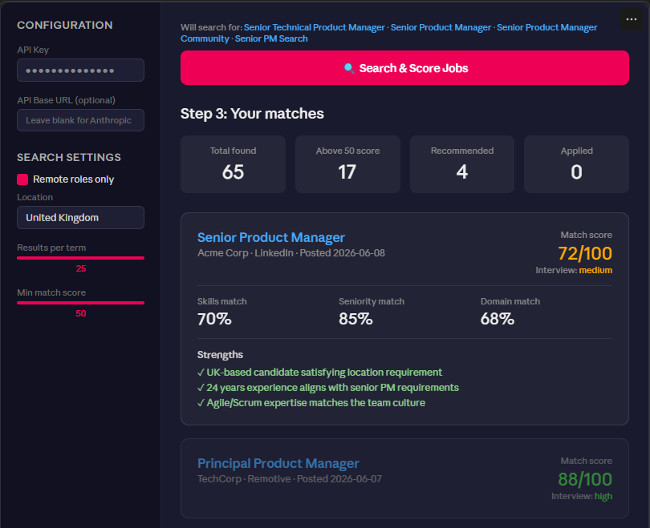

# Job Hunter

An AI-powered job search assistant built with Python and Streamlit. Upload your CV, and it searches job boards, scores each role against your profile, and ranks them by fit — so you spend time on the right applications, not scrolling through noise.

Built in a few evenings using AI-assisted development.



---

## What it does

1. **Parses your CV** — uploads a PDF and uses Claude to extract your skills, experience, seniority, and domains into a structured profile
2. **Searches job boards** — queries LinkedIn, Indeed, and others via `python-jobspy` using terms derived from your profile
3. **Scores every role** — Claude reads each job description and scores it 0–100 against your profile, with a short explanation
4. **Ranks results** — shows a sortable table of scored jobs so the best matches rise to the top

---

## Setup

### Requirements
- Python 3.11+
- An Anthropic API key (or compatible LLM gateway)

### Install

```bash
git clone https://github.com/Briancoughlin/job-hunter.git
cd job-hunter
pip install -r requirements.txt
pip install python-jobspy --no-deps
```

> **Note:** `python-jobspy` declares a dependency on an older numpy that doesn't have prebuilt wheels for Python 3.12+. Installing it with `--no-deps` skips that constraint — it works fine with numpy 2.x at runtime.

### Configure

```bash
cp .env.example .env
# Edit .env and add your ANTHROPIC_API_KEY
```

### Run

```bash
streamlit run app.py
```

Opens at http://localhost:8501

### Install as a desktop app (PWA)

Once running, open http://localhost:8501 in Chrome or Edge and click the **install icon** (⊕) in the address bar → **Install Job Hunter**. It opens in its own window without a browser bar, just like a native app.

---

## Usage

1. Enter your API key in the sidebar
2. Upload your CV (PDF)
3. Click **Search & Score Jobs**
4. Browse the ranked results table

Your parsed profile is saved locally as `saved_profile.json` so you don't need to re-upload your CV on every run.

---

## Tech stack

- **Python** — backend logic
- **Streamlit** — UI
- **Claude (Anthropic)** — CV parsing and job scoring
- **python-jobspy** — job board scraping (LinkedIn, Indeed, Glassdoor, ZipRecruiter)
- **pdfplumber** — PDF text extraction

---

## Privacy

Everything runs locally. Your CV and profile data never leave your machine beyond the API calls to Claude for parsing and scoring.

---

## Licence

MIT
